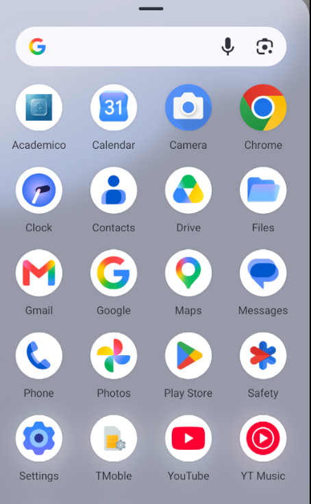
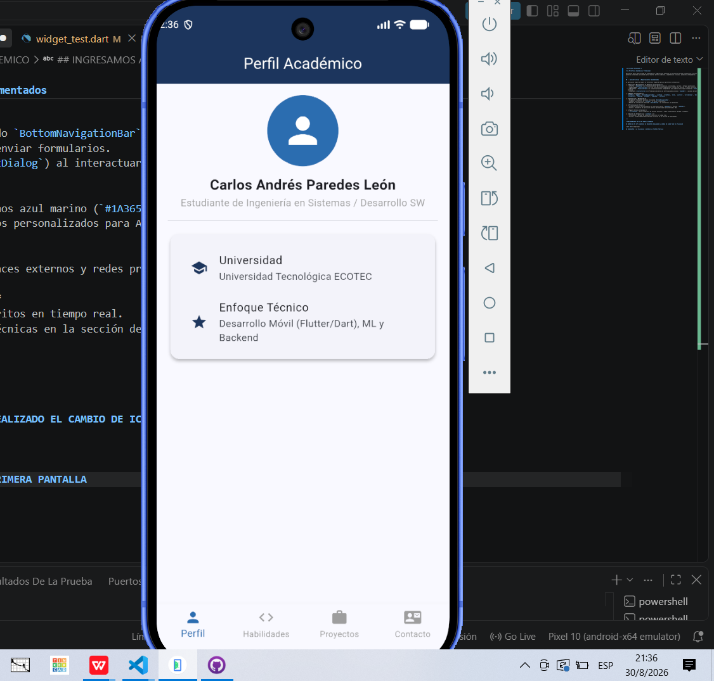
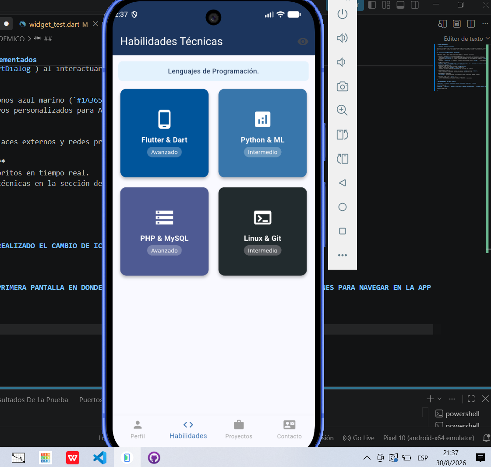
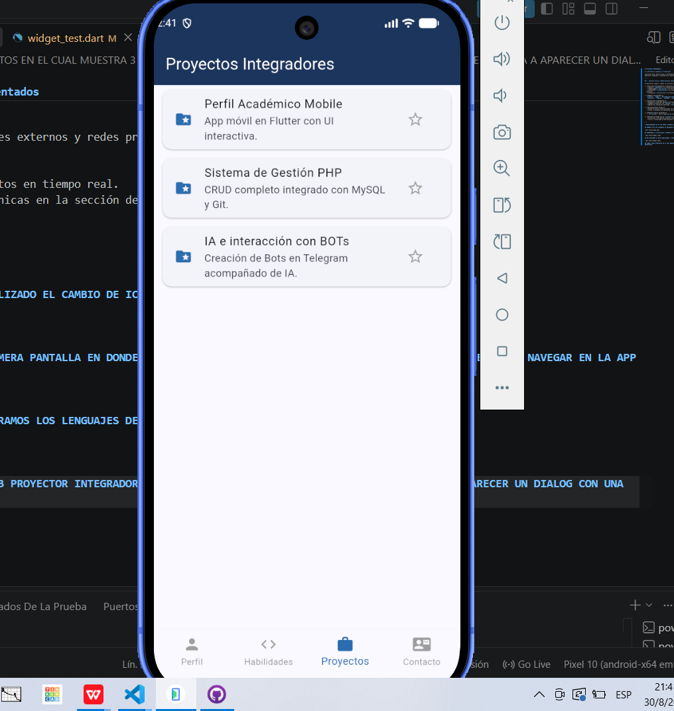
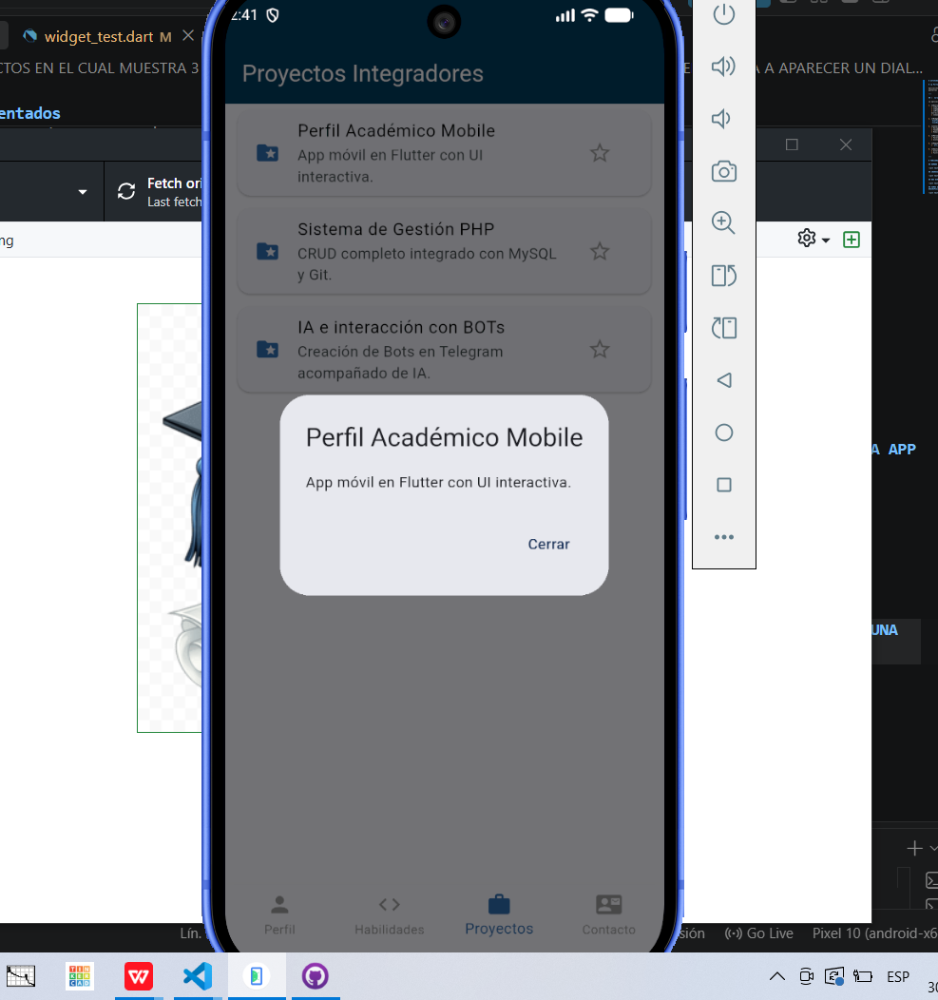
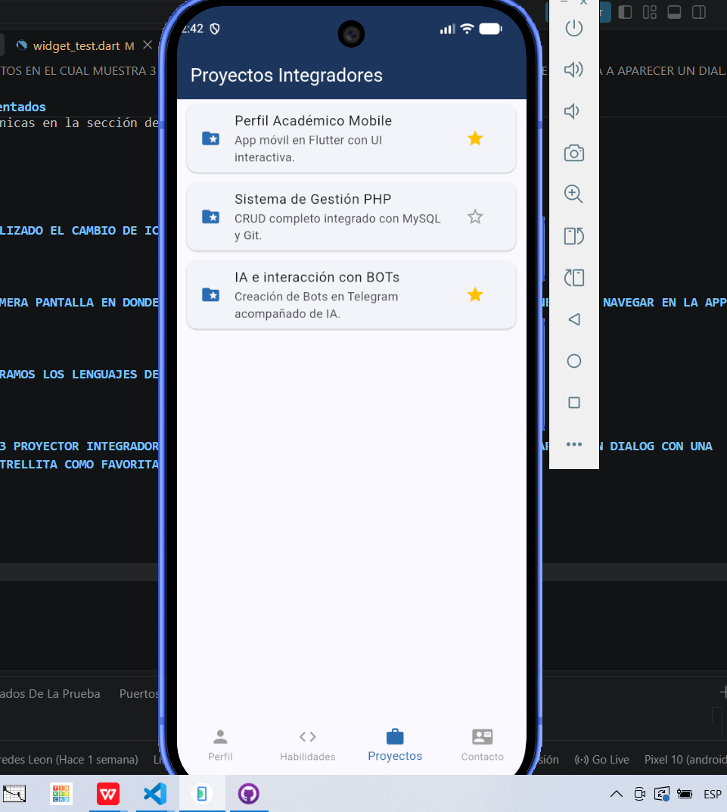
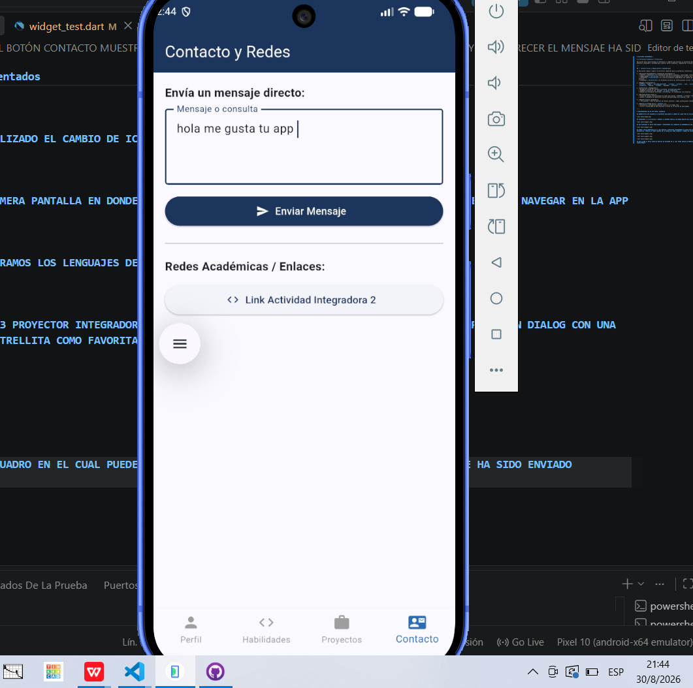
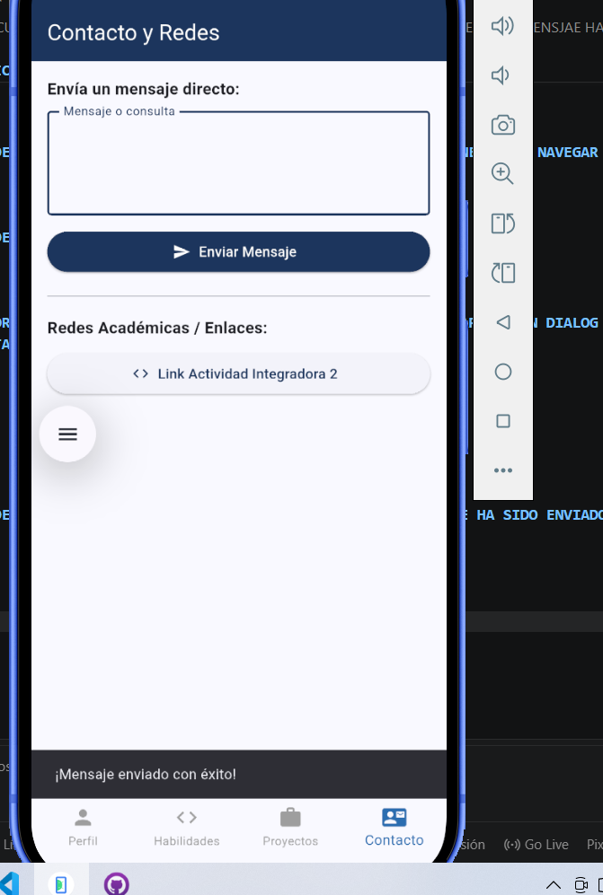
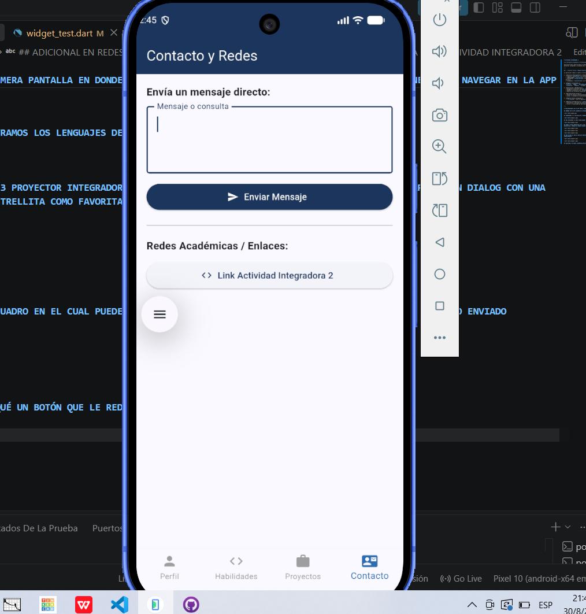
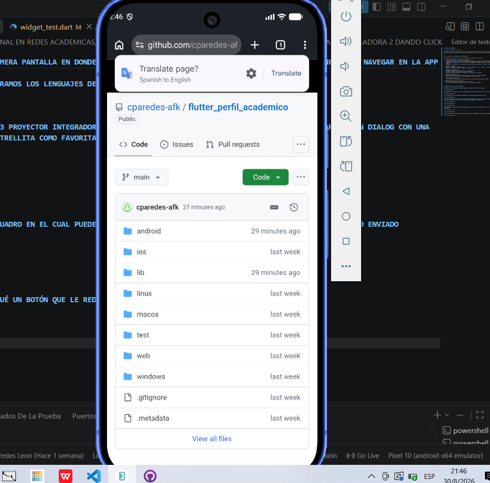

# ACTIVIDAD INTEGRADORA 2

# 📱 Portafolio Académico y Profesional

Aplicación móvil desarrollada en **Flutter** y **Dart** que presenta un portafolio personal interactivo, estructurado bajo una arquitectura de pantallas integradas y diseñada para resaltar perfil académico, competencias técnicas, proyectos integradores y canales de contacto.

---

## 🚀 Características y Requerimientos Implementados

La aplicación cumple y supera la estructura requerida para un portafolio interactivo:

1. **Estructura Multipantalla (4 Pantallas principales):**
   * **Perfil (`HomeScreen`):** Presentación del perfil académico, universidad, carrera y enfoque profesional.
   * **Habilidades (`SkillsScreen`):** Grid interactivo de competencias técnicas con colores e íconos temáticos personalizados por tecnología.
   * **Proyectos (`ProjectsScreen`):** Lista de proyectos integradores con cuadros de diálogo en detalle (`AlertDialog`) y sistema de favoritos dinámico.
   * **Contacto (`ContactScreen`):** Formulario directo con notificaciones activas (`SnackBar`) y accesos directos a redes externas.

2. **Widgets Incorporados:**
   `Scaffold`, `AppBar`, `BottomNavigationBar`, `ListView`, `GridView`, `Card`, `ListTile`, `CircleAvatar`, `Divider`, `Icon`, `ElevatedButton`, `IconButton`, `Padding`, `SizedBox`, `Expanded`, `Container`.

3. **Interacción y Navegación:**
   * Navegación fluida por pestañas utilizando `BottomNavigationBar`.
   * Feedback interactivo con `SnackBar` al enviar formularios.
   * Modales de información detallada (`AlertDialog`) al interactuar con proyectos.

4. **Personalización Visual:**
   * Paleta de colores institucionales en tonos azul marino (`#1A365D`) y celeste (`#2B6CB0`).
   * Íconos y lanzadores de aplicación nativos personalizados para Android e iOS.

5. **Paquete Externo Integrado:**
   * `url_launcher`: Para la apertura de enlaces externos y redes profesionales (GitHub, LinkedIn).

6. **Gestión de Estado Básico (`setState`):**
   * Alternancia y marcado de proyectos favoritos en tiempo real.
   * Filtro y visibilidad de descripciones técnicas en la sección de habilidades.

---

# FUNCIONAMIENTO DE MI APP PERFIL ACADEMICO

## NOMBRE DE MI APP ACADEMICO SE ENCUENTRA REALIZADO EL CAMBIO DE ICONO PARA MI APLICACIÓN 

## INGRESAMOS A LA APLICACIÓN A APARECE LA PRIMERA PANTALLA EN DONDE MUESTRA MIS DATOS Y EN LA PARTE INFERIOR LOS 4 BOTONES PARA NAVEGAR EN LA APP

## NOS DIRIGIMOS AL BOTÓN HABILIDADES Y ENCONTRAMOS LOS LENGUAJES DE PROGRAMACIÓN QUE UTILIZO

## VAMOS A BOTÓN PROYECTOS EN EL CUAL MUESTRA 3 PROYECTOR INTEGRADORES SE PUEDE DAR QLICK EN CADA UNO DE ELLOS Y VA A APARECER UN DIALOG CON UNA DESCRIPCIÓN, TAMBIEN SE PUEDE COLOCAR EN LA ESTRELLITA COMO FAVORITA Y CAMBIA DE COLOR

## POR ULTIMO EL BOTÓN CONTACTO MUESTRA UN RECUADRO EN EL CUAL PUEDE ENVIAR UN MENSAJE DA CLICK Y VA A PARECER EL MENSJAE HA SIDO ENVIADO CORRECTAMENTE 

## ADICIONAL EN REDES ACADEMICAS/ENLACES COLOQUÉ UN BOTÓN QUE LE REDIRECCIONA A MI ACTIVIDAD INTEGRADORA 2 DANDO CLICK 

