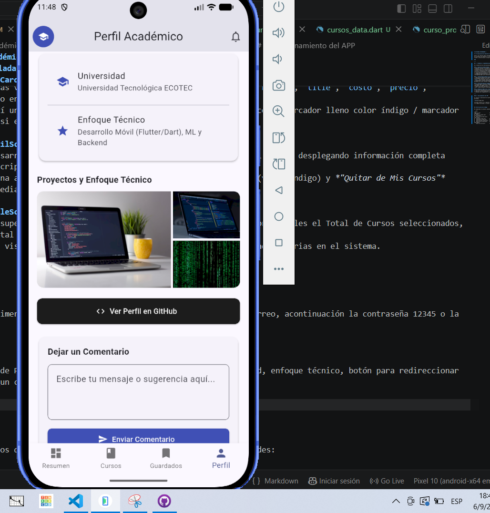
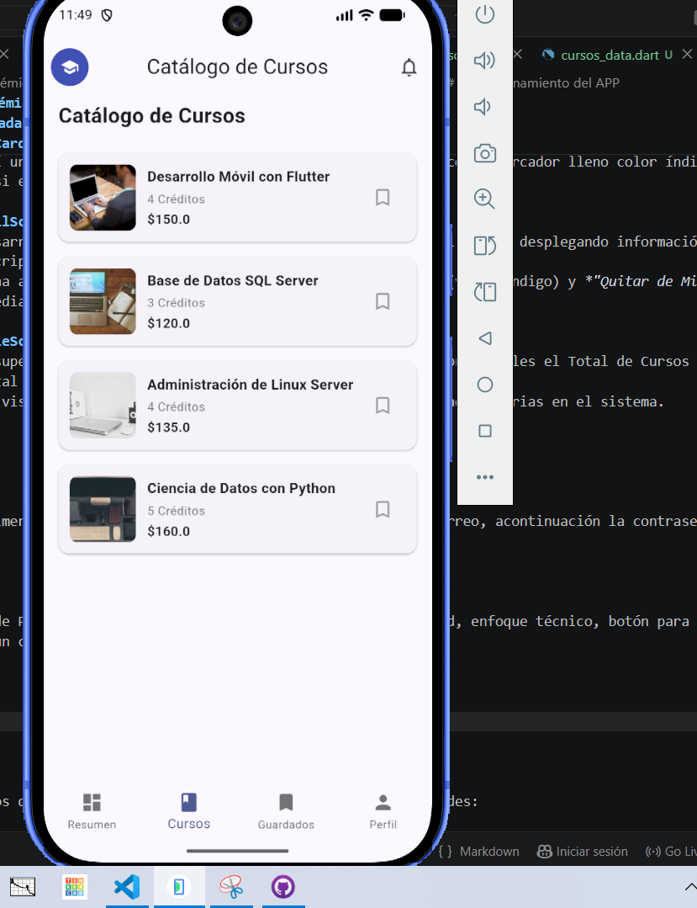
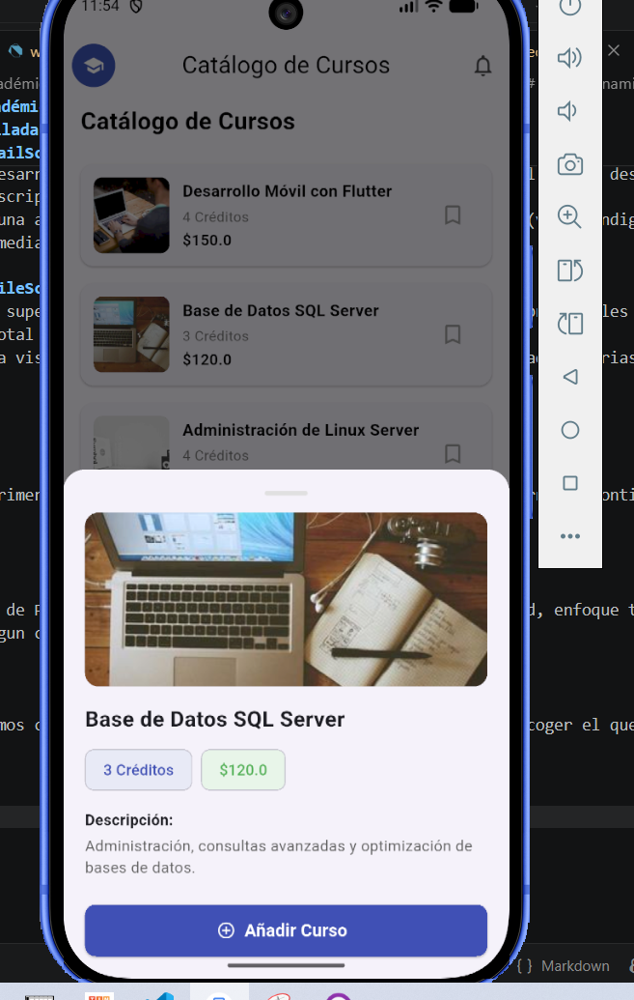
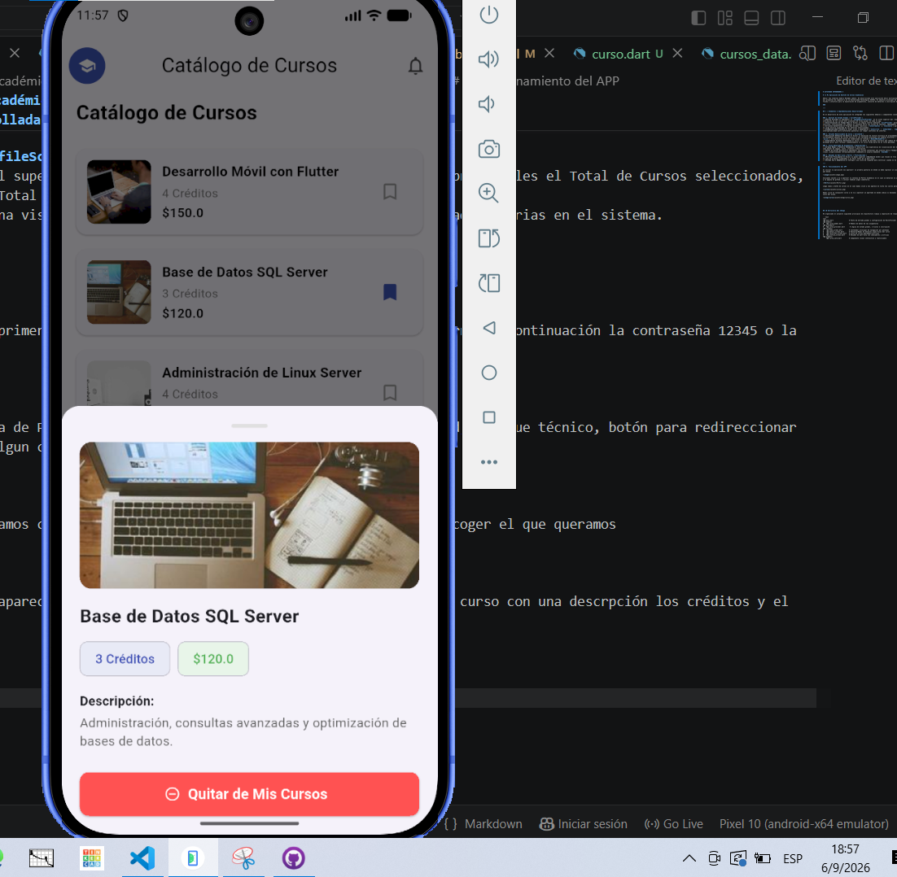
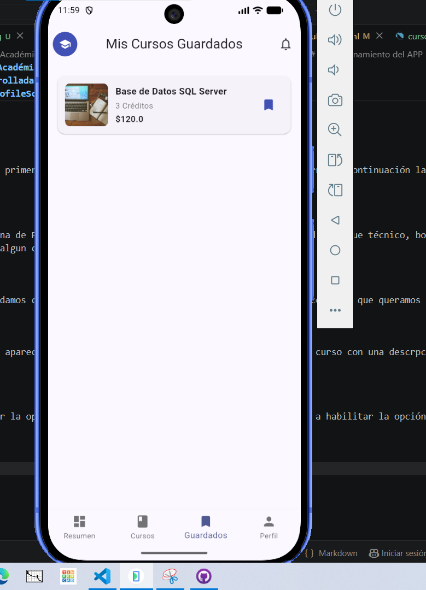
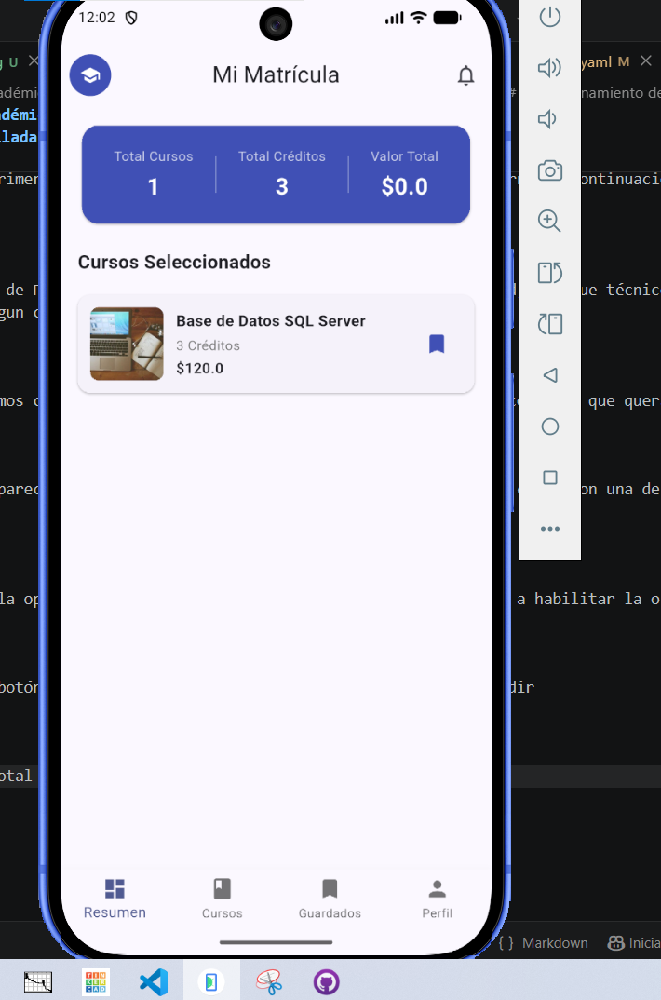
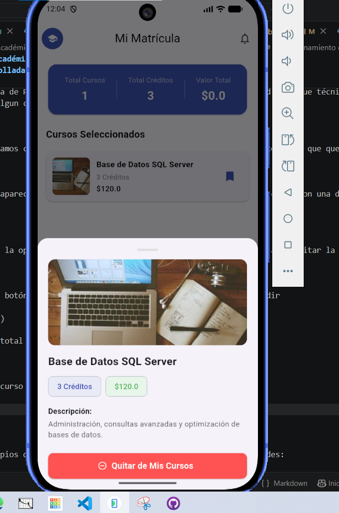

# ACTIVIDAD INTEGRADORA 3

# 🎓 Mi Aplicación de Gestión de Cursos Académicos

Autor:  **Carlos Andrés Paredes León**. He desarrollado esta aplicación móvil multiplataforma utilizando **Flutter** y **Dart** como parte de mis proyectos de ingeniería en la Universidad Tecnológica ECOTEC. El objetivo principal de este proyecto es ofrecer una experiencia de usuario fluida e intuitiva para la exploración de asignaturas, consulta de detalles e inscripción dinámica de cursos.

###

---

## 🛠️ Elementos e Implementaciones Desarrolladas

En el desarrollo de esta aplicación he integrado los siguientes módulos y componentes clave:

### 1. Gestión de Estado Global (`CursoProvider`)
* **Patrón Provider:** Implementé un `ChangeNotifierProvider` en el nivel superior del árbol de widgets (`main.dart`) para garantizar que la información de los cursos esté accesible de forma global en toda la app.
* **Sincronización en Tiempo Real:** Diseñé la lógica central mediante `CursoProvider` para administrar la lista de asignaturas guardadas o inscritas, sincronizando los cambios al instante entre las vistas de *Cursos*, *Guardados* y *Resumen*.
* **Cálculos Automáticos:** Programé métodos reactivos (`totalCreditos` y `totalCosto`) para procesar en tiempo real el costo total financiero y la carga horaria acumulada de las materias seleccionadas.
* **Compatibilidad Flexible:** Añadí alias y adaptadores (`esInscrito` / `esGuardado`, `toggleInscripcion` / `toggleGuardar`) para asegurar la interoperabilidad entre diferentes pantallas sin romper contratos de interfaz.

### 2. Tarjeta Reutilizable de Curso (`CursoCard`)
* **Extracción Defensiva de Datos:** Diseñé un mecanismo de lectura dinámica de propiedades (`_obtenerPropiedad`) que me permite renderizar correctamente objetos de cursos incluso si las variables provienen con nombres distintos (`titulo`, `nombre`, `title`, `costo`, `precio`, `price`). Esto previene fallos de renderizado en runtime (`NoSuchMethodError`).
* **Indicadores Visuales Relevantes:** Incluí un botón de marcador dinámico que cambia de estilo e ícono (marcador lleno color índigo / marcador bordeado gris) para reflejar inmediatamente si el curso forma parte de mi lista guardada.

### 3. Vista Detallada de Asignaturas (`DetailScreen`)
* **Sábana Modal y Pantalla Standalone:** Desarrollé una experiencia de visualización del detalle del curso, desplegando información completa como banner de imagen, costo, créditos y descripción.
* **Botón de Acción Dinámico:** Implementé una acción contextual que alterna entre *"Añadir Curso"* (verde/índigo) y *"Quitar de Mis Cursos"* (rojo), proporcionando retroalimentación inmediata al usuario mediante `SnackBar`.

### 4. Resumen de Matrícula y Perfil (`ProfileScreen`)
* **Métricas Principales:** Diseñé un panel superior (*Dashboard Card*) que resume en tres columnas principales el Total de Cursos seleccionados, la suma de Créditos acumulados y el Valor Total de la matrícula.
* **Estado Vacío Adaptativo:** Configuré una vista de respaldo para notificar cuando no he seleccionado materias en el sistema.

---

### 5. Funcionamiento del APP

Al iniciar la aplicación nos aparecerá la primera pantalla en dónde se debe ingresar un usuario o correo, acontinuación la contraseña 12345 o la que desee.


Iniciamos sesión y va a aparecer la ventana de Perfil Academico en el cual se detallan la universidad, enfoque técnico, botón para redireccionar a la pagina de github, y colocar tambien algun comentario.



Luego vamos a botón de cursos en el cual damos click y nos aparece en lista los cusros para poder escoger el que queramos 



Damos click en cualquiero curso y no va a aparecer un apartado en donde indica si deseamos añadir el curso con una descrpción los créditos y el valos del mismo.



Al dar click en añadir curso va a aparecer la opción de quitar curso en caso que lo desee sino se va a habilitar la opción favoritos



Una vez que se me guarda el curso vamos al botón guardados y va a aparecer el curso que acabo de añadir 



Vamos al botón resumen y va a aparecer el total de cursos y el total de creditos 



Sino deseamos ese curso damos click en el curso guardado y podemos quitar el curso e inmeditamente el cotador vuelve a 0 o a su vez a los cursos que esten guardados




## 📂 Estructura del Código

He organizado el proyecto siguiendo principios de arquitectura limpia y separación de responsabilidades:

```text
lib/
├── main.dart                   # Punto de entrada global y configuración de MultiProvider
├── models/
│   └── curso_model.dart        # Modelo de datos de las asignaturas
├── providers/
│   └── curso_provider.dart      # Lógica de estado global, cálculos e inscripción
├── screens/
│   ├── home_screen.dart        # Contenedor principal de navegación por pestañas
│   ├── detail_screen.dart      # Pantalla/Modal de detalles específicos del curso
│   ├── favorites_screen.dart   # Vista de cursos guardados/inscritos
│   └── profile_screen.dart     # Resumen de matrícula con indicadores y métricas
└── widgets/
    └── curso_card.dart         # Componente visual interactivo y reutilizable
